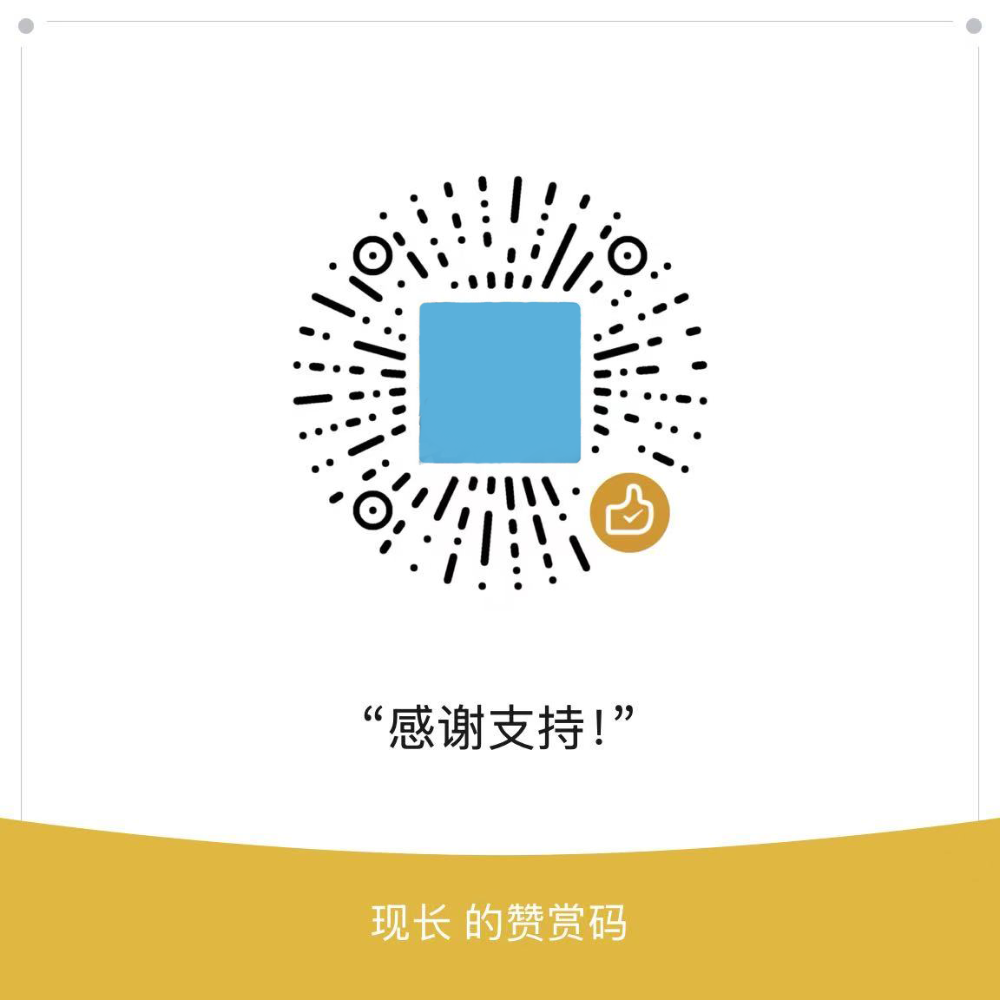

# 📝 JmniSurveyEdit & JmniSurveyPreview 使用文档

## 简介

该组件组合用于 **问卷创建与预览** 场景，适用于后台管理系统中问卷配置、编辑、展示与提交逻辑的统一管理。

---

## 安装

```bash
npm install jmni-survey
# or
yarn add jmni-survey
```

## 使用

```typescript
// 在 main.ts 中引入
import { createApp } from 'vue'
import DomComponents from 'jmni-survey'
import 'jmni-survey/dist/style.css'

const app = createApp(App)
app.use(DomComponents)
```

### 按需引入
```typescript
import { JmniSurveyEdit, JmniSurveyPreview } from 'jmni-survey'
app.component('JmniSurveyEdit', JmniSurveyEdit);
app.component('JmniSurveyPreview', JmniSurveyPreview);
```

## 📦 组件列表

### ✅ `JmniSurveyEdit`

问卷编辑器，支持：

* 多语言标题、描述设置
* 多语言支持配置
* 问卷题目编辑
* 配置项编辑（如是否需要登录等）
* 预览、保存事件支持

### ✅ `JmniSurveyPreview`

问卷预览器，支持：

* 回答视图渲染
* 问题序号展示控制
* 自定义提交按钮
* 提交事件监听

---

## 🔧 使用方式

```vue
<template>
  <JmniSurveyEdit 
    :title="surveyConfig.title"
    :desc="surveyConfig.desc"
    :supported_languages="supported_languages"
    :selected_languages="surveyConfig.languageslist"
    :topics="topics"
    :config="surveyAttributeConfigValue"
    :config_value="{
      login_required: true,
      require_game_binding: false,
    }"
    :show_question_index="false"
    @save="save"
    @preview="preview"
  />

  <JmniSurveyPreview
    :uselocale="uselocale"
    :topics="survey.topics"
    :show_question_index="!!survey.show_question_index"
    :selected_languages="survey.languageslist"
    type="preview"
    @submit="submit"
  >
    <template #submit>
      <n-button class="btn" :loading="submitLoading" type="primary">提交</n-button>
    </template>
  </JmniSurveyPreview>
</template>
```

---

## 🎛️ JmniSurveyEdit Props

| Prop 名称               | 类型                        | 默认值                                  | 说明         |
| --------------------- | ------------------------- | ------------------------------------ | ---------- |
| `supported_languages` | `SupportedLanguage[]`     | `[ { name: '简体中文', code: 'zhCN' } ]` | 支持的语言列表    |
| `selected_languages`  | `string[]`                | `['zhCN']`                           | 当前选中的语言列表  |
| `title`               | `LocaleText`    | `-`                                  | 问卷标题（可多语言） |
| `desc`                | `LocaleText`    | `-`                                  | 问卷描述（可多语言） |
| `end_message`         | `LocaleText`    | `-`                                  | 问卷结束提示信息   |
| `show_question_index` | `boolean`                 | `false`                              | 是否显示题号     |
| `topics`              | `ItemQuestionUnion[]`     | `[]`                                 | 问卷题目数组     |
| `config`              | `SurveyAttributeConfig[]` | `[]`                                 | 问卷支持的配置项定义 |
| `config_value`        | `SurveyAttributeModel`    | `{}`                                 | 配置项的实际值对象  |

### Emits

* `@save`: 保存事件，携带当前问卷内容
* `@preview`: 预览事件
* `@update:value`: 双向绑定（若使用 `v-model`）

---

## 🎛️ JmniSurveyPreview Props

| Prop 名称               | 类型                                                  | 默认值                     | 说明                  |
| --------------------- | --------------------------------------------------- | ----------------------- | ------------------- |
| `selected_languages`  | `string[]`                                          | `['zhCN']`              | 当前选中的语言列表           |
| `uselocale`           | `string`                                            | *required*              | 当前展示语言（例如 `'zhCN'`） |
| `show_question_index` | `boolean`                                           | `false`                 | 是否显示题目序号            |
| `type`                | `'preview' \| 'write'`                              | `'write'`               | 预览或填写类型             |
| `topics`              | `ItemQuestionUnion[]`                               | `[]`                    | 渲染的问题列表             |
| `uploadFunction`      | `(file: UploadFileInfo) => Promise<UploadFileInfo>` | `()=>Promise.resolve()` | 文件上传函数              |

### 插槽

| 插槽名称     | 描述               |
| -------- | ---------------- |
| `submit` | 提交按钮插槽，可替换默认提交按钮 |

### Emits

* `@submit`: 提交事件，携带用户填写结果

---

## 📁 类型说明（常用）

### SupportedLanguage

```ts
interface SupportedLanguage {
  name: string;
  code: string; // 如 'zhCN', 'enUS'
}
```

### LocaleText

```ts
type LocaleText = {
  [lang: string]: string; // 例如 { zhCN: '标题', enUS: 'Title' }
}
```

### SurveyAttributeModel 示例

```ts
interface SurveyAttributeModel {
  login_required: boolean;
  [key: string]: boolean | string | number | [string, string] | [number, number];
}
```

---

## 🧩 示例数据

```ts
const supported_languages = [
  { name: '简体中文', code: 'zhCN' },
  { name: 'English', code: 'enUS' },
];

const surveyConfig = {
  title: { zhCN: '问卷标题', enUS: 'Survey Title' },
  desc: { zhCN: '问卷描述', enUS: 'Survey Description' },
  languageslist: ['zhCN', 'enUS']
};

const topics = [
  {
    "id": "q1",
    "type": "checkbox",
    "title": {
      "enUS": "What color do you like?",
      "zhCN": "你喜欢什么颜色？"
    },
    "options": [
      {
        "label": {
          "enUS": "Red",
          "zhCN": "红色"
        }
      },
      {
        "label": {
          "enUS": "Blue",
          "zhCN": "蓝色"
        }
      }
    ]
  }
];
```

---

## 📌 注意事项

* `title`、`desc`、`end_message` 支持传入多语言对象或普通字符串。
* `preview` 和 `edit` 可独立使用，也可联动配合使用。
* 所有涉及多语言的字段应尽量统一使用 `LocaleText` 类型。
* 组件内部使用 `naive-ui` 组件库，需要项目已正确引入。

---

## 📞 事件用法示例

```ts
const save = (data) => {
  console.log('保存问卷内容:', data);
};

const preview = (data) => {
  console.log('预览问卷内容:', data);
};

const submit = (answers) => {
  console.log('用户提交的答卷:', answers);
};
```

---

## 📚 TODO（建议迭代方向）

* 支持字段级别的校验规则配置
* 支持题目类型扩展（矩阵、多选下拉等）
* 异步配置加载
* 表单字段联动逻辑可视化

---

如需进一步文档或集成示例，请联系开发团队。

---

## 许可证

MIT 

如果觉得不错，请支持下作者
